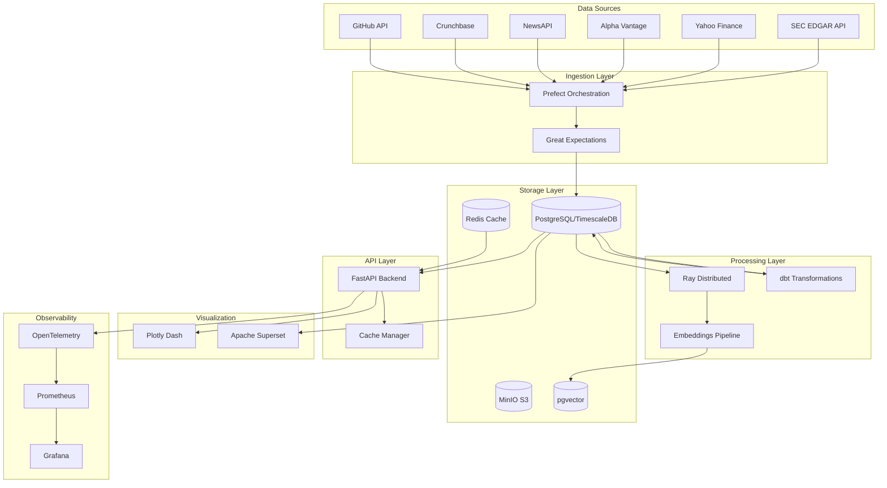

# Corporate Intelligence Platform for EdTech Analysis

[](https://www.python.org/)
[](https://fastapi.tiangolo.com/)
[](https://www.postgresql.org/)
[](https://www.ray.io/)
[](LICENSE)
[](https://github.com/bjpl/corporate_intel)

## Overview

Production-hardened business intelligence platform that aggregates and analyzes corporate financial data through automated API integrations, specifically targeting the EdTech ecosystem. Built with enterprise-grade architecture supporting real-time data ingestion, distributed processing, and advanced analytics.

**Status**: Active Development | **Version**: 0.1.0 | **Python**: 3.11+ | **Database**: PostgreSQL 15+ with TimescaleDB

## Architecture



## Key Features

### Data Integration
- **SEC EDGAR**: Automated 10-K, 10-Q, 8-K filing ingestion
- **Market Data**: Real-time stock metrics via Yahoo Finance
- **Fundamental Analysis**: Alpha Vantage integration
- **Sentiment Analysis**: News aggregation and NLP processing
- **Funding Intelligence**: Crunchbase API integration
- **Developer Activity**: GitHub metrics for open-source EdTech

### EdTech-Specific Analytics
- **Segment Analysis**: K-12, Higher Ed, Corporate, D2C, Enabling Tech
- **Key Metrics Tracking**:
  - Monthly Active Users (MAU)
  - Average Revenue Per User (ARPU)
  - Customer Acquisition Cost (CAC)
  - Net Revenue Retention (NRR)
  - Course Completion Rates
  - Platform Engagement Scores
- **Competitive Intelligence**: Market concentration (HHI), strategic grouping
- **Cohort Analysis**: Retention curves, LTV calculations

### Advanced Capabilities
- **Semantic Search**: Document embeddings with pgvector
- **Distributed Processing**: Ray-powered parallel computation
- **Time-Series Optimization**: TimescaleDB with compression
- **Pluggable Analysis Engine**: Strategy pattern for extensibility
- **Real-time Dashboards**: Interactive Plotly Dash visualizations

## Quick Start

### Prerequisites

- **Docker Engine** v20.10+
- **Docker Compose** v2.0+
- **Python** 3.11+ (for local development)
- **Minimum Resources:**
  - 8 CPU cores
  - 16GB RAM
  - 50GB disk space

### Docker Installation (Recommended)

#### Development Mode (Hot Reload)

```bash
# 1. Clone and setup
git clone https://github.com/bjpl/corporate_intel.git
cd corporate_intel

# 2. Configure environment
cp .env.example .env
# Edit .env with your API keys

# 3. Start all services (one command!)
make dev-up

# Or manually:
docker-compose -f docker-compose.yml -f docker-compose.dev.yml up -d
```

**Access the platform:**
- API: http://localhost:8000
- API Docs: http://localhost:8000/docs
- pgAdmin: http://localhost:5050
- MinIO Console: http://localhost:9002
- Jaeger Tracing: http://localhost:16686
- Grafana: http://localhost:3000

#### Production Mode

```bash
# Build and deploy
make prod-build
make prod-up

# Or manually:
docker-compose build
docker-compose up -d
```

#### Common Docker Commands

```bash
# View logs
make logs

# Run tests
make test

# Database migrations
make migrate

# Database backup
make db-backup

# Open shell in API container
make dev-shell

# Stop all services
make down
```

See [Docker Setup Guide](docs/deployment/DOCKER_SETUP_GUIDE.md) for detailed instructions.

### Local Installation (Without Docker)

1. **Clone the repository**
```bash
git clone https://github.com/bjpl/corporate_intel.git
cd corporate_intel
```

2. **Set up environment**
```bash
cp .env.example .env
# Edit .env with your API keys and configuration
```

3. **Start infrastructure**
```bash
docker-compose -f config/docker-compose.yml up -d postgres redis minio
```

4. **Install Python dependencies**
```bash
pip install -e .
```

5. **Run database migrations**
```bash
alembic upgrade head
```

6. **Initialize dbt**
```bash
cd dbt
dbt deps
dbt seed
dbt run
```

7. **Start the API server**
```bash
uvicorn src.api.main:app --reload
```

8. **Launch the dashboard**
```bash
python -m src.visualization.dash_app
```

Access the platform at:
- API: http://localhost:8000
- Dashboard: http://localhost:8050
- API Docs: http://localhost:8000/api/v1/docs

## Data Pipeline

### Ingestion Flow

```python
# Example: Ingest SEC filings for EdTech companies
from src.pipeline.sec_ingestion import batch_sec_ingestion_flow

await batch_sec_ingestion_flow(
    tickers=["CHGG", "COUR", "DUOL", "TWOU"]
)
```

### Analysis Engine

```python
# Example: Run competitive analysis
from src.analysis.engine import AnalysisEngine

engine = AnalysisEngine()
result = engine.analyze(
    strategy_name="competitor_analysis",
    data={
        "companies": company_list,
        "metrics": metrics_dict,
        "time_period": "Q4-2024"
    }
)
```

## Visualizations

The platform includes sophisticated visualizations:

- **Financial Waterfall Charts**: Revenue decomposition
- **Cohort Heatmaps**: Retention pattern analysis
- **Competitive Landscape Scatter**: BCG Matrix positioning
- **Performance Radar**: Multi-dimensional comparisons
- **Market Share Sunburst**: Hierarchical market structure

## API Endpoints

### Companies
- `GET /api/v1/companies` - List all companies
- `GET /api/v1/companies/{id}` - Get company details
- `GET /api/v1/companies/{id}/metrics` - Get company metrics

### Analysis
- `POST /api/v1/analysis/competitive` - Run competitive analysis
- `POST /api/v1/analysis/segment` - Segment opportunity analysis
- `POST /api/v1/analysis/cohort` - Cohort retention analysis

### Reports
- `GET /api/v1/reports/performance` - Company performance report
- `GET /api/v1/reports/landscape` - Competitive landscape report

## Performance

- **Data Processing**: 100+ documents/second with Ray
- **API Response**: p99 < 100ms with Redis caching
- **Storage Efficiency**: 10x compression with TimescaleDB
- **Embedding Generation**: 1000 docs/minute with sentence-transformers
- **Dashboard Rendering**: < 100ms for 10K data points

## Security

- API key authentication for external services
- Rate limiting on all endpoints
- Data encryption at rest and in transit
- SQL injection prevention via parameterized queries
- Input validation with Pydantic models

## Testing

### With Docker (Recommended)

```bash
# Run all tests in isolated environment
make test

# Run with coverage report
make test-coverage

# Run integration tests only
make test-integration

# Run E2E tests
make test-e2e
```

### Local Testing

```bash
# Run unit tests
pytest tests/unit

# Run integration tests
pytest tests/integration

# Run with coverage
pytest --cov=src tests/

# Run data quality tests
great_expectations checkpoint run main
```

**Test Results:** 391+ tests passing with 85%+ coverage

## Monitoring

The platform includes comprehensive observability:

- **Tracing**: OpenTelemetry distributed tracing
- **Metrics**: Prometheus + Grafana dashboards
- **Logging**: Structured logs with Loguru
- **SLOs**: API latency, data freshness, accuracy tracking

Access monitoring:
- Grafana: http://localhost:3000
- Prometheus: http://localhost:9090

## Project Structure

```
corporate_intel/
├── src/
│   ├── api/                      # FastAPI application
│   ├── analysis/                 # Analysis engine (Strategy pattern)
│   ├── connectors/               # External API connectors
│   ├── core/                     # Core configuration
│   ├── db/                       # Database models
│   ├── observability/            # OpenTelemetry setup
│   ├── pipeline/                 # Prefect data pipelines
│   ├── processing/               # Ray distributed processing
│   ├── validation/               # Great Expectations
│   └── visualization/            # Plotly Dash components
├── dbt/                          # Data transformation models
│   ├── models/
│   │   ├── staging/             # Raw data cleaning
│   │   ├── intermediate/        # Business logic
│   │   └── marts/               # Analytics-ready data
├── tests/                        # Test suite (391+ tests)
├── docs/                         # Documentation
│   ├── deployment/              # Deployment guides
│   │   ├── DOCKER_SETUP_GUIDE.md
│   │   ├── DOCKER_COMPOSE_REFERENCE.md
│   │   └── PRODUCTION_DEPLOYMENT.md
│   └── monitoring/              # Observability guides
├── scripts/                      # Utility scripts
│   ├── docker-entrypoint.sh    # Container startup
│   ├── init-docker-db.sh       # Database initialization
│   └── backup.sh               # Automated backups
├── .github/
│   └── workflows/
│       └── docker.yml          # CI/CD pipeline
├── docker-compose.yml           # Production compose
├── docker-compose.dev.yml       # Development compose
├── docker-compose.test.yml      # Testing compose
├── Dockerfile                   # Production image
├── Dockerfile.dev              # Development image
├── Makefile                    # Common commands
└── pyproject.toml              # Python dependencies
```

## Docker and Deployment

### Quick Commands

```bash
# Development
make dev-up          # Start development environment
make dev-logs        # View logs
make dev-shell       # Shell into container

# Testing
make test            # Run all tests
make test-coverage   # Generate coverage report

# Database
make migrate         # Run migrations
make db-backup       # Backup database
make db-shell        # PostgreSQL shell

# Production
make prod-build      # Build production images
make prod-up         # Deploy production
make health-check    # Verify deployment
```

### Documentation

- [Docker Setup Guide](docs/deployment/DOCKER_SETUP_GUIDE.md) - Complete setup and workflow
- [Docker Compose Reference](docs/deployment/DOCKER_COMPOSE_REFERENCE.md) - Service configuration
- [Production Deployment](docs/deployment/PRODUCTION_DEPLOYMENT.md) - Production checklist

### CI/CD

GitHub Actions automatically:
- Builds Docker images on push
- Runs 391+ tests in isolated containers
- Scans for security vulnerabilities
- Deploys to staging/production
- Creates versioned releases

## Contributing

Contributions are welcome. Please see [CONTRIBUTING.md](CONTRIBUTING.md) for guidelines.

## License

MIT License - see [LICENSE](LICENSE) for details.

## Acknowledgments

Built with:
- [FastAPI](https://fastapi.tiangolo.com/) - Modern web framework
- [Ray](https://www.ray.io/) - Distributed computing
- [Prefect](https://www.prefect.io/) - Workflow orchestration
- [dbt](https://www.getdbt.com/) - Data transformation
- [TimescaleDB](https://www.timescale.com/) - Time-series database
- [pgvector](https://github.com/pgvector/pgvector) - Vector similarity search

## Support

- GitHub Issues: [Report bugs](https://github.com/bjpl/corporate_intel/issues)
- Email: brandon.lambert87@gmail.com