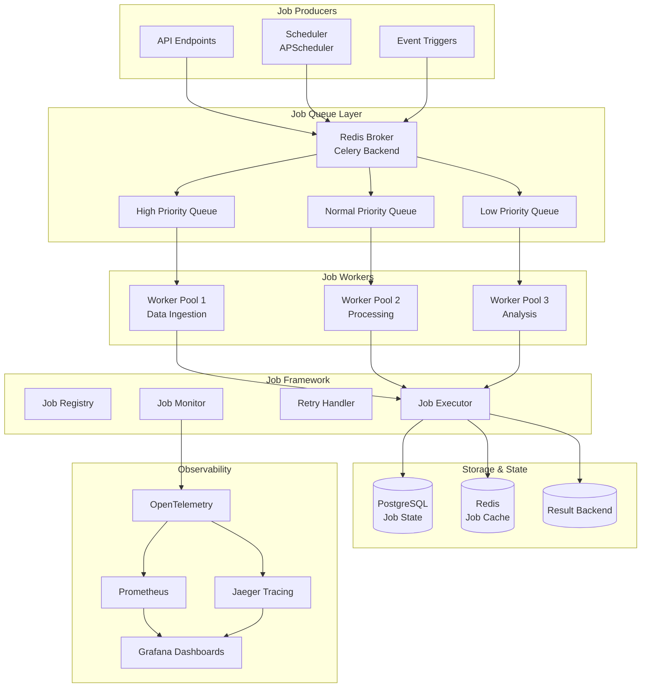
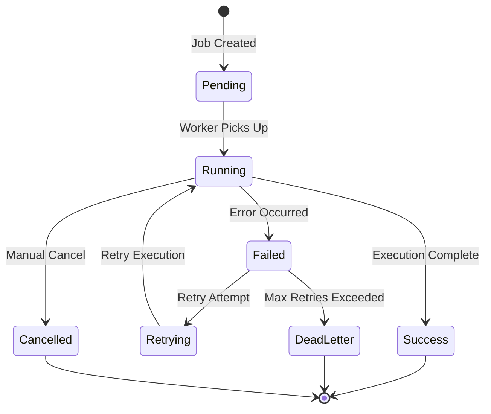

# Job Orchestration Architecture
## Corporate Intelligence Platform

**SPARC Phase:** Architecture
**Date:** 2025-11-20
**Status:** Design Complete
**Version:** 1.0

---

## Executive Summary

This document defines the standardized job orchestration architecture for the corporate intelligence platform's data ingestion, processing, and analysis workflows. The architecture consolidates existing job patterns into a unified, scalable, and observable system.

**Key Design Decisions:**
- **Queue System:** Celery with Redis backend (production-ready, battle-tested)
- **Workflow Orchestration:** Prefect for complex workflows, Celery for simple jobs
- **Job Framework:** Standardized job definition with retry, monitoring, and error handling
- **Observability:** Integrated with existing OpenTelemetry infrastructure
- **Migration Strategy:** Phased migration with backward compatibility

---

## Table of Contents

1. [Current State Analysis](#current-state-analysis)
2. [Architecture Overview](#architecture-overview)
3. [Queue Architecture](#queue-architecture)
4. [Job Definition Framework](#job-definition-framework)
5. [Job Lifecycle Management](#job-lifecycle-management)
6. [Error Handling & Retry Logic](#error-handling--retry-logic)
7. [Monitoring & Observability](#monitoring--observability)
8. [Migration Strategy](#migration-strategy)
9. [Implementation Roadmap](#implementation-roadmap)

---

## Current State Analysis

### Existing Job Patterns

#### 1. SEC Ingestion Pipeline
**File:** `src/pipeline/sec_ingestion.py`

**Current Pattern:**
```python
# Prefect-based workflow
@flow(retries=2, retry_delay_seconds=300)
async def sec_ingestion_flow(request: FilingRequest):
    company_data = await fetch_company_data(request.company_ticker)
    filings = await fetch_filings(company_data["cik"], ...)
    downloaded_filings = await asyncio.gather(*download_tasks)
    # Store filings...
```

**Characteristics:**
- ✅ Async execution with `asyncio.gather()`
- ✅ Retry logic via Prefect decorators
- ✅ Rate limiting (custom `RateLimiter` class)
- ✅ Circuit breaker pattern
- ✅ Data validation (Great Expectations)
- ⚠️ No centralized queue
- ⚠️ Mixed responsibility (orchestration + business logic)

**Strengths:**
- Production-ready Prefect integration
- Comprehensive error handling
- Good observability hooks

**Weaknesses:**
- Tightly coupled to Prefect
- No job prioritization
- Limited scalability for high-volume ingestion

---

#### 2. Yahoo Finance Ingestion
**File:** `src/pipeline/yahoo_finance_ingestion.py`

**Current Pattern:**
```python
class YahooFinanceIngestionPipeline:
    async def run(self) -> Dict[str, Any]:
        for idx, company_data in enumerate(EDTECH_COMPANIES):
            yf_data = await self._fetch_yahoo_finance_data(ticker)
            company = await self._upsert_company(company_data, yf_data)
            await self._ingest_quarterly_financials(company, ticker)
```

**Characteristics:**
- ✅ Class-based pipeline design
- ✅ Circuit breaker protection
- ✅ Progress tracking via coordination hooks
- ✅ Sequential processing with rate limiting
- ⚠️ No queue system
- ⚠️ Manual retry logic

**Strengths:**
- Clean separation of concerns
- Good error tracking
- Coordination hook integration

**Weaknesses:**
- Sequential processing (no parallelization)
- No job persistence
- Hard-coded company lists

---

#### 3. Alpha Vantage Ingestion
**File:** `src/pipeline/alpha_vantage_ingestion.py`

**Current Pattern:**
```python
async def run_alpha_vantage_ingestion(tickers: List[str], delay_between_calls: int = 12):
    for idx, ticker in enumerate(tickers):
        result = await ingest_alpha_vantage_for_company(ticker, connector, session)
        if idx < len(tickers):
            await asyncio.sleep(delay_between_calls)
```

**Characteristics:**
- ✅ Custom retry with exponential backoff
- ✅ Result tracking (`AlphaVantageIngestionResult`)
- ✅ Error categorization
- ✅ Rate limiting (12s delays)
- ⚠️ Sequential processing only
- ⚠️ No job scheduling

**Strengths:**
- Excellent error handling
- Detailed result tracking
- Rate limit compliance

**Weaknesses:**
- No concurrency
- Manual delay management
- Limited scalability

---

### Common Utilities Analysis
**File:** `src/pipeline/common/utilities.py`

**Reusable Components:**
```python
# Generic retry decorator
@retry_with_backoff(max_retries=3, base_delay=2.0, exponential=True)
async def fetch_data(...):
    pass

# Coordination hooks
await run_coordination_hook("pre-task", description="...")
await notify_progress("Processed 10/27 companies")

# Database utilities
await get_or_create_company(session, ticker, ...)
await upsert_financial_metric(session, company_id, ...)
```

**Strengths:**
- ✅ Reusable across pipelines
- ✅ Consistent patterns
- ✅ Good abstraction

**Gaps:**
- ❌ No job definition standard
- ❌ No queue integration
- ❌ No centralized scheduling

---

### Observability Infrastructure
**File:** `src/observability/telemetry.py`

**Current Capabilities:**
- OpenTelemetry tracing (Jaeger)
- Prometheus metrics
- Custom business metrics
- SLO monitoring
- Auto-instrumentation (FastAPI, SQLAlchemy, Redis, AioHttp)

**Key Metrics:**
```python
'api_requests_total'          # API calls
'documents_processed_total'   # Document processing
'processing_time_seconds'     # Processing duration
'cache_hits/misses'           # Cache performance
'ray_workers_active'          # Worker capacity
```

**Integration Opportunities:**
- ✅ Ready for job-level tracing
- ✅ Metrics for queue depth, job duration
- ✅ SLO monitoring for job SLAs

---

## Architecture Overview

### High-Level Design



### Design Principles

1. **Separation of Concerns**
   - Job definition ≠ Job execution
   - Business logic ≠ Orchestration logic
   - Configuration ≠ Implementation

2. **Scalability**
   - Horizontal worker scaling
   - Queue-based load distribution
   - Async-first design

3. **Reliability**
   - Automatic retry with backoff
   - Circuit breakers for external APIs
   - Dead letter queues for failed jobs

4. **Observability**
   - End-to-end tracing
   - Real-time metrics
   - SLO monitoring

5. **Developer Experience**
   - Simple job definition API
   - Clear error messages
   - Easy local testing

---

## Queue Architecture

### Technology Choice: Celery + Redis

**Rationale:**
- ✅ **Production-proven:** Used by Instagram, Pinterest, Robinhood
- ✅ **Python-native:** First-class asyncio support
- ✅ **Feature-rich:** Priorities, routing, rate limiting, schedules
- ✅ **Observable:** Monitoring tools (Flower, Prometheus exporter)
- ✅ **Scalable:** Handles 1000s of jobs/second
- ✅ **Flexible:** Support for various backends (Redis, RabbitMQ, SQS)

**Alternatives Considered:**
| Solution | Pros | Cons | Decision |
|----------|------|------|----------|
| **Celery** | Battle-tested, feature-rich | Complex config | ✅ **Selected** |
| **RQ (Redis Queue)** | Simple, lightweight | Limited features | ❌ Too basic |
| **Dramatiq** | Modern, clean API | Smaller ecosystem | ❌ Less mature |
| **Prefect** | Great workflows | Overhead for simple jobs | ✅ For complex workflows |
| **AWS SQS + Lambda** | Serverless, scalable | Vendor lock-in | ❌ Not cloud-agnostic |

**Decision:** Use **Celery for job execution** + **Prefect for complex workflows**

---

### Queue Configuration

#### Queue Topology

```python
# config/celery_config.py
from kombu import Queue, Exchange

CELERY_TASK_QUEUES = (
    # High priority: Real-time API requests, critical updates
    Queue('high_priority',
          Exchange('high_priority'),
          routing_key='high',
          priority=10),

    # Normal priority: Scheduled ingestion, routine processing
    Queue('normal_priority',
          Exchange('normal_priority'),
          routing_key='normal',
          priority=5),

    # Low priority: Background analytics, cleanup tasks
    Queue('low_priority',
          Exchange('low_priority'),
          routing_key='low',
          priority=1),

    # Dead Letter Queue: Failed jobs after max retries
    Queue('dead_letter',
          Exchange('dead_letter'),
          routing_key='failed'),
)

CELERY_TASK_ROUTES = {
    # Data Ingestion Jobs
    'jobs.ingestion.sec.*': {'queue': 'normal_priority'},
    'jobs.ingestion.yahoo.*': {'queue': 'normal_priority'},
    'jobs.ingestion.alpha_vantage.*': {'queue': 'low_priority'},  # Rate-limited

    # Processing Jobs
    'jobs.processing.filing_analysis': {'queue': 'normal_priority'},
    'jobs.processing.sentiment_analysis': {'queue': 'low_priority'},

    # Real-time Jobs
    'jobs.realtime.update_metrics': {'queue': 'high_priority'},
    'jobs.realtime.alert_trigger': {'queue': 'high_priority'},
}
```

#### Worker Pool Configuration

```python
# Worker pools by job type
WORKER_POOLS = {
    'ingestion': {
        'concurrency': 4,      # 4 concurrent ingestion jobs
        'queues': ['normal_priority', 'low_priority'],
        'max_tasks_per_child': 100,  # Restart after 100 tasks (prevent memory leaks)
    },
    'processing': {
        'concurrency': 8,      # 8 concurrent processing jobs
        'queues': ['normal_priority'],
        'max_tasks_per_child': 50,
    },
    'realtime': {
        'concurrency': 16,     # 16 concurrent real-time jobs
        'queues': ['high_priority'],
        'max_tasks_per_child': 1000,
    },
}

# Resource limits
CELERY_TASK_TIME_LIMIT = 3600       # 1 hour hard limit
CELERY_TASK_SOFT_TIME_LIMIT = 3000  # 50 minutes soft limit
CELERY_WORKER_PREFETCH_MULTIPLIER = 4  # Prefetch 4 tasks per worker
```

---

## Job Definition Framework

### Standardized Job Interface

```python
# src/jobs/base.py
from abc import ABC, abstractmethod
from dataclasses import dataclass
from datetime import datetime
from enum import Enum
from typing import Any, Dict, Optional, List
from uuid import UUID, uuid4

from celery import Task
from loguru import logger
from pydantic import BaseModel, Field

from src.observability.telemetry import TelemetryManager, trace_async


class JobStatus(str, Enum):
    """Job execution status."""
    PENDING = "pending"
    RUNNING = "running"
    SUCCESS = "success"
    FAILED = "failed"
    RETRYING = "retrying"
    CANCELLED = "cancelled"


class JobPriority(int, Enum):
    """Job priority levels."""
    HIGH = 10
    NORMAL = 5
    LOW = 1


class JobResult(BaseModel):
    """Standardized job result."""
    job_id: UUID
    status: JobStatus
    started_at: datetime
    completed_at: Optional[datetime] = None
    result: Optional[Dict[str, Any]] = None
    error: Optional[str] = None
    error_traceback: Optional[str] = None
    retry_count: int = 0
    metrics: Dict[str, Any] = Field(default_factory=dict)


class JobConfig(BaseModel):
    """Job configuration."""
    # Retry configuration
    max_retries: int = 3
    retry_backoff: bool = True
    retry_backoff_max: int = 600  # 10 minutes
    retry_jitter: bool = True

    # Rate limiting
    rate_limit: Optional[str] = None  # e.g., "10/m" (10 per minute)

    # Timeout configuration
    time_limit: int = 3600  # 1 hour
    soft_time_limit: int = 3000  # 50 minutes

    # Queue configuration
    queue: str = "normal_priority"
    priority: JobPriority = JobPriority.NORMAL

    # Circuit breaker
    circuit_breaker_enabled: bool = True
    circuit_breaker_threshold: int = 5
    circuit_breaker_timeout: int = 60

    # Observability
    trace_enabled: bool = True
    log_level: str = "INFO"


class BaseJob(ABC, Task):
    """Base class for all jobs in the platform.

    Provides:
    - Standardized lifecycle hooks
    - Automatic retry with exponential backoff
    - Circuit breaker integration
    - OpenTelemetry tracing
    - Prometheus metrics
    - Error handling and logging

    Usage:
        class MyIngestionJob(BaseJob):
            config = JobConfig(
                max_retries=3,
                rate_limit="10/m",
                queue="normal_priority"
            )

            async def execute(self, params: Dict[str, Any]) -> Dict[str, Any]:
                # Your job logic here
                return {"status": "success"}
    """

    # Job configuration (override in subclasses)
    config: JobConfig = JobConfig()

    # Job metadata
    name: str = "base_job"
    description: str = ""
    version: str = "1.0.0"

    def __init__(self):
        super().__init__()
        self.telemetry = TelemetryManager()
        self.job_id = uuid4()
        self.result = None

    @abstractmethod
    async def execute(self, params: Dict[str, Any]) -> Dict[str, Any]:
        """Execute the job.

        Args:
            params: Job parameters

        Returns:
            Job result dictionary

        Raises:
            Exception: If job execution fails
        """
        pass

    async def run(self, params: Dict[str, Any]) -> JobResult:
        """Run the job with full lifecycle management.

        This method should not be overridden. Override `execute()` instead.
        """
        result = JobResult(
            job_id=self.job_id,
            status=JobStatus.PENDING,
            started_at=datetime.utcnow(),
        )

        try:
            # Pre-execution hook
            await self.on_before_execute(params)

            # Execute with tracing
            with self.telemetry.trace_span(
                f"job.{self.name}",
                attributes={
                    "job.id": str(self.job_id),
                    "job.name": self.name,
                    "job.version": self.version,
                }
            ) as span:
                result.status = JobStatus.RUNNING

                # Execute the job
                execution_result = await self.execute(params)

                # Success
                result.status = JobStatus.SUCCESS
                result.result = execution_result
                result.completed_at = datetime.utcnow()

                # Record metrics
                duration = (result.completed_at - result.started_at).total_seconds()
                self.telemetry.record_metric(
                    'job_duration_seconds',
                    duration,
                    {'job_name': self.name, 'status': 'success'}
                )

                if span:
                    span.set_attribute("job.status", "success")
                    span.set_attribute("job.duration_seconds", duration)

            # Post-execution hook
            await self.on_after_execute(result)

        except Exception as e:
            # Handle failure
            result.status = JobStatus.FAILED
            result.error = str(e)
            result.completed_at = datetime.utcnow()

            logger.error(
                f"Job {self.name} failed: {e}",
                extra={
                    "job_id": str(self.job_id),
                    "job_name": self.name,
                    "error": str(e),
                }
            )

            # Record failure metric
            self.telemetry.record_metric(
                'job_failures_total',
                1,
                {'job_name': self.name, 'error_type': type(e).__name__}
            )

            # On failure hook
            await self.on_failure(e, result)

            raise

        finally:
            # Cleanup hook
            await self.on_cleanup(result)

        return result

    async def on_before_execute(self, params: Dict[str, Any]) -> None:
        """Hook called before job execution."""
        logger.info(f"Starting job {self.name} (ID: {self.job_id})")

    async def on_after_execute(self, result: JobResult) -> None:
        """Hook called after successful execution."""
        logger.info(f"Job {self.name} completed successfully (ID: {self.job_id})")

    async def on_failure(self, error: Exception, result: JobResult) -> None:
        """Hook called on job failure."""
        logger.error(f"Job {self.name} failed (ID: {self.job_id}): {error}")

    async def on_cleanup(self, result: JobResult) -> None:
        """Hook called for cleanup (always runs)."""
        pass

    def should_retry(self, error: Exception) -> bool:
        """Determine if the job should retry on this error.

        Override to customize retry logic.
        """
        # Don't retry on validation errors
        if isinstance(error, (ValueError, TypeError)):
            return False

        # Retry on network errors
        return True
```

---

### Job Type Definitions

#### 1. Data Ingestion Jobs

```python
# src/jobs/ingestion/sec_ingestion_job.py
from datetime import datetime, timedelta
from typing import Any, Dict, List

from src.jobs.base import BaseJob, JobConfig, JobPriority
from src.pipeline.sec_ingestion import SECAPIClient, fetch_company_data, fetch_filings


class SECIngestionJob(BaseJob):
    """Job for ingesting SEC filings for a single company."""

    name = "sec_ingestion"
    description = "Ingest SEC filings (10-K, 10-Q, 8-K) for a company"
    version = "1.0.0"

    config = JobConfig(
        max_retries=3,
        retry_backoff=True,
        rate_limit="10/m",  # SEC rate limit: 10 requests/second
        queue="normal_priority",
        priority=JobPriority.NORMAL,
        time_limit=1800,  # 30 minutes
        circuit_breaker_enabled=True,
    )

    async def execute(self, params: Dict[str, Any]) -> Dict[str, Any]:
        """Execute SEC ingestion for a company.

        Args:
            params: {
                'ticker': str,
                'filing_types': List[str],
                'start_date': str (ISO format),
                'end_date': str (ISO format)
            }

        Returns:
            {
                'ticker': str,
                'cik': str,
                'filings_found': int,
                'filings_stored': int,
                'errors': List[str]
            }
        """
        ticker = params['ticker']
        filing_types = params.get('filing_types', ['10-K', '10-Q', '8-K'])
        start_date = datetime.fromisoformat(params.get('start_date',
            (datetime.now() - timedelta(days=365)).isoformat()))

        # Fetch company data
        company_data = await fetch_company_data(ticker)

        if not company_data.get('cik'):
            raise ValueError(f"No CIK found for ticker {ticker}")

        # Fetch filings
        filings = await fetch_filings(
            company_data['cik'],
            filing_types,
            start_date
        )

        # Store filings (implementation details omitted)
        # ... storage logic ...

        return {
            'ticker': ticker,
            'cik': company_data['cik'],
            'filings_found': len(filings),
            'filings_stored': len(filings),  # Simplified
            'errors': []
        }


class BatchSECIngestionJob(BaseJob):
    """Job for batch SEC ingestion across multiple companies."""

    name = "batch_sec_ingestion"
    description = "Batch ingest SEC filings for multiple companies"
    version = "1.0.0"

    config = JobConfig(
        max_retries=2,
        queue="normal_priority",
        time_limit=7200,  # 2 hours
    )

    async def execute(self, params: Dict[str, Any]) -> Dict[str, Any]:
        """Execute batch SEC ingestion.

        Args:
            params: {
                'tickers': List[str],
                'filing_types': List[str],
                'start_date': str
            }
        """
        from celery import group

        tickers = params['tickers']

        # Create a Celery group for parallel execution
        job_group = group(
            SECIngestionJob().s({
                'ticker': ticker,
                'filing_types': params.get('filing_types'),
                'start_date': params.get('start_date'),
            })
            for ticker in tickers
        )

        # Execute group and collect results
        result = job_group.apply_async()
        results = result.get()

        return {
            'total_companies': len(tickers),
            'successful': sum(1 for r in results if r['filings_stored'] > 0),
            'failed': sum(1 for r in results if r['filings_stored'] == 0),
            'total_filings': sum(r['filings_stored'] for r in results),
        }
```

#### 2. Data Processing Jobs

```python
# src/jobs/processing/filing_analysis_job.py
class FilingAnalysisJob(BaseJob):
    """Job for analyzing SEC filings using LLM."""

    name = "filing_analysis"
    description = "Analyze SEC filings for key insights"
    version = "1.0.0"

    config = JobConfig(
        max_retries=2,
        queue="normal_priority",
        time_limit=600,  # 10 minutes
    )

    async def execute(self, params: Dict[str, Any]) -> Dict[str, Any]:
        """Analyze a filing.

        Args:
            params: {
                'filing_id': str,
                'analysis_types': List[str]  # ['sentiment', 'risks', 'metrics']
            }
        """
        # Analysis logic here
        pass
```

#### 3. Scheduled Jobs

```python
# src/jobs/scheduled/daily_refresh_job.py
class DailyDataRefreshJob(BaseJob):
    """Job for daily data refresh across all companies."""

    name = "daily_data_refresh"
    description = "Refresh financial data for all tracked companies"
    version = "1.0.0"

    config = JobConfig(
        max_retries=1,
        queue="low_priority",
        time_limit=14400,  # 4 hours
    )

    async def execute(self, params: Dict[str, Any]) -> Dict[str, Any]:
        """Execute daily refresh."""
        # Trigger ingestion jobs for all companies
        pass
```

---

## Job Lifecycle Management

### Job State Machine



### State Persistence

```python
# src/jobs/state.py
from sqlalchemy import Column, String, DateTime, JSON, Enum as SQLEnum
from sqlalchemy.dialects.postgresql import UUID

from src.db.base import Base
from src.jobs.base import JobStatus


class JobExecution(Base):
    """Job execution state table."""

    __tablename__ = "job_executions"

    id = Column(UUID(as_uuid=True), primary_key=True)
    job_name = Column(String(255), nullable=False, index=True)
    job_version = Column(String(50), nullable=False)
    status = Column(SQLEnum(JobStatus), nullable=False, index=True)

    # Timing
    created_at = Column(DateTime, nullable=False, index=True)
    started_at = Column(DateTime)
    completed_at = Column(DateTime)

    # Parameters and results
    parameters = Column(JSON)
    result = Column(JSON)
    error_message = Column(String)
    error_traceback = Column(String)

    # Execution metadata
    retry_count = Column(Integer, default=0)
    worker_id = Column(String(255))
    queue_name = Column(String(255))

    # Metrics
    duration_seconds = Column(Float)
    metrics = Column(JSON)
```

### Job Tracking API

```python
# src/jobs/tracker.py
from typing import Optional
from uuid import UUID

from sqlalchemy.ext.asyncio import AsyncSession

from src.jobs.base import JobResult, JobStatus
from src.jobs.state import JobExecution


class JobTracker:
    """Track job execution state in database."""

    def __init__(self, session: AsyncSession):
        self.session = session

    async def create_execution(self, job_result: JobResult) -> JobExecution:
        """Create a new job execution record."""
        execution = JobExecution(
            id=job_result.job_id,
            job_name=job_result.job_name,
            status=job_result.status,
            created_at=job_result.started_at,
            parameters=job_result.parameters,
        )

        self.session.add(execution)
        await self.session.commit()

        return execution

    async def update_execution(self, job_result: JobResult) -> None:
        """Update job execution state."""
        execution = await self.session.get(JobExecution, job_result.job_id)

        if execution:
            execution.status = job_result.status
            execution.completed_at = job_result.completed_at
            execution.result = job_result.result
            execution.error_message = job_result.error
            execution.retry_count = job_result.retry_count

            await self.session.commit()

    async def get_execution(self, job_id: UUID) -> Optional[JobExecution]:
        """Get job execution by ID."""
        return await self.session.get(JobExecution, job_id)

    async def get_recent_executions(
        self,
        job_name: Optional[str] = None,
        status: Optional[JobStatus] = None,
        limit: int = 100
    ) -> List[JobExecution]:
        """Get recent job executions with optional filtering."""
        from sqlalchemy import select

        query = select(JobExecution).order_by(JobExecution.created_at.desc())

        if job_name:
            query = query.where(JobExecution.job_name == job_name)

        if status:
            query = query.where(JobExecution.status == status)

        query = query.limit(limit)

        result = await self.session.execute(query)
        return result.scalars().all()
```

---

## Error Handling & Retry Logic

### Retry Strategy

```python
# src/jobs/retry.py
from typing import Callable, Type, Tuple
import asyncio
import random

from loguru import logger


class RetryStrategy:
    """Configurable retry strategy with exponential backoff."""

    def __init__(
        self,
        max_retries: int = 3,
        base_delay: float = 2.0,
        max_delay: float = 600.0,
        exponential_base: float = 2.0,
        jitter: bool = True,
        retry_on: Tuple[Type[Exception], ...] = (Exception,),
        no_retry_on: Tuple[Type[Exception], ...] = (ValueError, TypeError),
    ):
        self.max_retries = max_retries
        self.base_delay = base_delay
        self.max_delay = max_delay
        self.exponential_base = exponential_base
        self.jitter = jitter
        self.retry_on = retry_on
        self.no_retry_on = no_retry_on

    def calculate_delay(self, attempt: int) -> float:
        """Calculate delay for retry attempt with exponential backoff + jitter."""
        # Exponential backoff: delay = base * (exponential_base ^ attempt)
        delay = min(
            self.base_delay * (self.exponential_base ** attempt),
            self.max_delay
        )

        # Add jitter to prevent thundering herd
        if self.jitter:
            jitter_range = delay * 0.1  # ±10%
            delay += random.uniform(-jitter_range, jitter_range)

        return max(0, delay)

    def should_retry(self, error: Exception, attempt: int) -> bool:
        """Determine if job should retry."""
        # Max retries exceeded
        if attempt >= self.max_retries:
            return False

        # Don't retry specific exceptions
        if isinstance(error, self.no_retry_on):
            logger.info(f"Not retrying {type(error).__name__}: non-retryable error")
            return False

        # Retry on specified exceptions
        if isinstance(error, self.retry_on):
            return True

        return False

    async def execute_with_retry(
        self,
        func: Callable,
        *args,
        **kwargs
    ):
        """Execute function with retry logic."""
        last_error = None

        for attempt in range(self.max_retries + 1):
            try:
                return await func(*args, **kwargs)

            except self.no_retry_on as e:
                logger.error(f"Non-retryable error: {e}")
                raise

            except self.retry_on as e:
                last_error = e

                if not self.should_retry(e, attempt):
                    logger.error(f"Max retries ({self.max_retries}) exceeded")
                    raise

                delay = self.calculate_delay(attempt)
                logger.warning(
                    f"Attempt {attempt + 1}/{self.max_retries} failed: {e}. "
                    f"Retrying in {delay:.2f}s..."
                )

                await asyncio.sleep(delay)

        # Should never reach here, but satisfy type checker
        if last_error:
            raise last_error
```

### Circuit Breaker Integration

```python
# Reuse existing circuit breaker from src/core/circuit_breaker.py
from src.core.circuit_breaker import CircuitBreaker

# Job-level circuit breaker
job_circuit_breaker = CircuitBreaker(
    failure_threshold=5,     # Open after 5 failures
    timeout_duration=60,     # Stay open for 60 seconds
    expected_exception=Exception
)

# Usage in jobs
class ExternalAPIJob(BaseJob):
    async def execute(self, params: Dict[str, Any]) -> Dict[str, Any]:
        # Wrap external API call with circuit breaker
        result = job_circuit_breaker.call(
            self._fetch_external_data,
            params['url']
        )

        if asyncio.iscoroutine(result):
            result = await result

        return result
```

### Dead Letter Queue

```python
# src/jobs/dead_letter.py
from datetime import datetime

from celery import Task


class DeadLetterHandler:
    """Handle jobs that have exceeded max retries."""

    @staticmethod
    async def handle_failed_job(
        job_id: UUID,
        job_name: str,
        error: Exception,
        params: Dict[str, Any],
        retry_count: int
    ) -> None:
        """Process failed job and send to dead letter queue."""
        from src.jobs.state import JobExecution
        from src.db.session import get_session_factory

        session_factory = get_session_factory()

        async with session_factory() as session:
            # Update job status
            execution = await session.get(JobExecution, job_id)
            if execution:
                execution.status = JobStatus.FAILED
                execution.error_message = str(error)
                execution.retry_count = retry_count
                execution.completed_at = datetime.utcnow()

                await session.commit()

        # Send alert
        logger.error(
            f"Job {job_name} ({job_id}) failed after {retry_count} retries. "
            f"Moved to dead letter queue. Error: {error}"
        )

        # Optional: Send notification (Slack, email, PagerDuty)
        # await send_alert(...)
```

---

## Monitoring & Observability

### Metrics Integration

```python
# src/jobs/metrics.py
from prometheus_client import Counter, Histogram, Gauge

# Job execution metrics
job_executions_total = Counter(
    'corporate_intel_job_executions_total',
    'Total job executions',
    ['job_name', 'status']
)

job_duration_seconds = Histogram(
    'corporate_intel_job_duration_seconds',
    'Job execution duration',
    ['job_name'],
    buckets=[1, 5, 10, 30, 60, 300, 600, 1800, 3600]
)

job_retries_total = Counter(
    'corporate_intel_job_retries_total',
    'Total job retries',
    ['job_name', 'error_type']
)

# Queue metrics
queue_depth = Gauge(
    'corporate_intel_queue_depth',
    'Number of jobs in queue',
    ['queue_name']
)

active_workers = Gauge(
    'corporate_intel_active_workers',
    'Number of active workers',
    ['pool_name']
)
```

### Tracing Integration

```python
# Automatic tracing via BaseJob.run()
# No additional code needed - traces are created for:
# - Job execution
# - Database operations
# - External API calls
# - Cache operations
```

### Grafana Dashboards

**Job Orchestration Dashboard:**
```yaml
# grafana/dashboards/job_orchestration.json
{
  "dashboard": {
    "title": "Job Orchestration",
    "panels": [
      {
        "title": "Job Execution Rate",
        "targets": [
          "rate(corporate_intel_job_executions_total[5m])"
        ]
      },
      {
        "title": "Job Success Rate",
        "targets": [
          "sum(rate(corporate_intel_job_executions_total{status='success'}[5m])) / sum(rate(corporate_intel_job_executions_total[5m]))"
        ]
      },
      {
        "title": "Queue Depth",
        "targets": [
          "corporate_intel_queue_depth"
        ]
      },
      {
        "title": "Job Duration (p95)",
        "targets": [
          "histogram_quantile(0.95, corporate_intel_job_duration_seconds_bucket)"
        ]
      }
    ]
  }
}
```

---

## Migration Strategy

### Phase 1: Foundation (Week 1-2)
**Goal:** Set up infrastructure without breaking existing pipelines

**Tasks:**
1. ✅ Install and configure Celery + Redis
2. ✅ Create base job framework (`BaseJob`, `JobConfig`)
3. ✅ Set up job state persistence (PostgreSQL table)
4. ✅ Implement retry strategy and circuit breaker integration
5. ✅ Add Prometheus metrics and Jaeger tracing
6. ✅ Create Grafana dashboards

**Deliverables:**
- `src/jobs/base.py` - Base job framework
- `src/jobs/config.py` - Celery configuration
- `alembic/versions/xxx_create_job_executions_table.py` - Migration
- `grafana/dashboards/job_orchestration.json` - Dashboard

**Success Criteria:**
- Celery workers running locally
- Jobs can be submitted and executed
- Metrics visible in Prometheus
- Traces visible in Jaeger

---

### Phase 2: Job Migration (Week 3-4)
**Goal:** Migrate existing pipelines to new framework

**Migration Order:**
1. **Alpha Vantage Ingestion** (simplest, good learning)
2. **Yahoo Finance Ingestion** (moderate complexity)
3. **SEC Ingestion** (most complex, Prefect integration)

**Migration Pattern:**
```python
# Before: Direct execution
async def run_alpha_vantage_ingestion(tickers: List[str]):
    for ticker in tickers:
        await ingest_alpha_vantage_for_company(ticker, ...)

# After: Job-based execution
class AlphaVantageIngestionJob(BaseJob):
    async def execute(self, params: Dict[str, Any]) -> Dict[str, Any]:
        ticker = params['ticker']
        return await ingest_alpha_vantage_for_company(ticker, ...)

# Batch job
class BatchAlphaVantageJob(BaseJob):
    async def execute(self, params: Dict[str, Any]) -> Dict[str, Any]:
        tickers = params['tickers']

        # Parallel execution via Celery group
        job_group = group(
            AlphaVantageIngestionJob().s({'ticker': t})
            for t in tickers
        )

        results = job_group.apply_async().get()
        return {'results': results}
```

**Deliverables:**
- `src/jobs/ingestion/alpha_vantage_job.py`
- `src/jobs/ingestion/yahoo_finance_job.py`
- `src/jobs/ingestion/sec_job.py`
- Updated API endpoints to submit jobs instead of running directly

**Success Criteria:**
- All three pipelines running via Celery
- Backward compatibility maintained (old scripts still work)
- Metrics showing job execution

---

### Phase 3: Scheduling (Week 5)
**Goal:** Add automated scheduling for recurring jobs

**Tasks:**
1. Set up Celery Beat for periodic tasks
2. Create scheduled job definitions
3. Add job scheduling API

**Scheduled Jobs:**
```python
# src/jobs/scheduler.py
from celery.schedules import crontab

CELERY_BEAT_SCHEDULE = {
    # Daily data refresh at 2 AM UTC
    'daily-data-refresh': {
        'task': 'jobs.scheduled.daily_refresh',
        'schedule': crontab(hour=2, minute=0),
        'args': (),
    },

    # Hourly metrics update
    'hourly-metrics-update': {
        'task': 'jobs.processing.update_metrics',
        'schedule': crontab(minute=0),  # Every hour
        'args': (),
    },

    # Weekly SEC filings check (Sunday 1 AM)
    'weekly-sec-check': {
        'task': 'jobs.ingestion.batch_sec',
        'schedule': crontab(day_of_week=0, hour=1, minute=0),
        'args': (),
    },
}
```

**Deliverables:**
- `src/jobs/scheduler.py` - Celery Beat schedule
- `src/jobs/scheduled/` - Scheduled job implementations

---

### Phase 4: Advanced Features (Week 6+)
**Goal:** Add production features

**Features:**
1. **Job Chaining:** SEC ingestion → Analysis → Report generation
2. **Job Workflows:** Prefect integration for complex DAGs
3. **Priority Queues:** Separate queues for different priorities
4. **Job Cancellation:** API to cancel running jobs
5. **Failure Alerts:** Slack/Email notifications for failures

**Example Workflow:**
```python
# Celery chain: ingestion -> analysis -> report
from celery import chain

workflow = chain(
    SECIngestionJob().s({'ticker': 'CHGG'}),
    FilingAnalysisJob().s(),
    GenerateReportJob().s(),
)

workflow.apply_async()
```

---

## Implementation Roadmap

### Milestones

| Milestone | Timeline | Key Deliverables | Success Criteria |
|-----------|----------|------------------|------------------|
| **M1: Foundation** | Week 1-2 | - Celery setup<br>- Base job framework<br>- Metrics & tracing | Workers running, metrics visible |
| **M2: Alpha Vantage Migration** | Week 3 | - Alpha Vantage job<br>- API updates | AV ingestion via jobs |
| **M3: Yahoo Finance Migration** | Week 3-4 | - Yahoo Finance job<br>- Batch execution | YF ingestion via jobs |
| **M4: SEC Migration** | Week 4 | - SEC job<br>- Prefect integration | SEC ingestion via jobs |
| **M5: Scheduling** | Week 5 | - Celery Beat<br>- Scheduled jobs | Automated daily refresh |
| **M6: Production Hardening** | Week 6+ | - Monitoring<br>- Alerting<br>- Documentation | Production-ready |

### Risk Mitigation

| Risk | Impact | Mitigation |
|------|--------|------------|
| **Celery learning curve** | Medium | Start with simple jobs, use extensive documentation |
| **Breaking existing pipelines** | High | Maintain backward compatibility, parallel run period |
| **Performance degradation** | Medium | Load testing, monitoring, gradual rollout |
| **Redis dependency** | Medium | Redis cluster for HA, fallback to database |
| **Complex migrations** | High | Phased approach, feature flags, rollback plan |

---

## Appendix

### A. Technology Stack

```yaml
Queue System:
  - Celery: 5.3.x
  - Redis: 7.x (broker + result backend)
  - Flower: 2.x (monitoring UI)

Workflow Orchestration:
  - Prefect: 2.x (complex workflows)

Observability:
  - OpenTelemetry: 1.x
  - Prometheus: latest
  - Jaeger: latest
  - Grafana: latest

Database:
  - PostgreSQL: 15.x (job state)
  - TimescaleDB: 2.x (metrics time-series)
```

### B. Configuration Example

```python
# config/celery_config.py
CELERY_CONFIG = {
    'broker_url': 'redis://localhost:6379/0',
    'result_backend': 'redis://localhost:6379/1',

    # Serialization
    'task_serializer': 'json',
    'result_serializer': 'json',
    'accept_content': ['json'],

    # Timezone
    'timezone': 'UTC',
    'enable_utc': True,

    # Worker configuration
    'worker_prefetch_multiplier': 4,
    'worker_max_tasks_per_child': 100,

    # Task configuration
    'task_acks_late': True,
    'task_reject_on_worker_lost': True,
    'task_time_limit': 3600,
    'task_soft_time_limit': 3000,

    # Retry configuration
    'task_autoretry_for': (Exception,),
    'task_retry_kwargs': {'max_retries': 3},
    'task_retry_backoff': True,
    'task_retry_backoff_max': 600,
    'task_retry_jitter': True,

    # Result backend
    'result_expires': 86400,  # 24 hours

    # Monitoring
    'worker_send_task_events': True,
    'task_send_sent_event': True,
}
```

### C. Deployment Configuration

```yaml
# docker-compose.yml
version: '3.8'

services:
  redis:
    image: redis:7-alpine
    ports:
      - "6379:6379"
    volumes:
      - redis_data:/data

  celery_worker_ingestion:
    build: .
    command: celery -A src.jobs.celery worker --queues=normal_priority,low_priority --concurrency=4
    depends_on:
      - redis
      - postgres
    environment:
      - CELERY_BROKER_URL=redis://redis:6379/0

  celery_worker_realtime:
    build: .
    command: celery -A src.jobs.celery worker --queues=high_priority --concurrency=16
    depends_on:
      - redis

  celery_beat:
    build: .
    command: celery -A src.jobs.celery beat
    depends_on:
      - redis

  flower:
    build: .
    command: celery -A src.jobs.celery flower
    ports:
      - "5555:5555"
    depends_on:
      - redis
```

---

## Document Control

**Author:** SPARC Architecture Agent
**Reviewers:** System Architect, Lead Developer
**Approval:** Technical Lead

**Version History:**
| Version | Date | Author | Changes |
|---------|------|--------|---------|
| 1.0 | 2025-11-20 | SPARC Agent | Initial architecture design |

**Related Documents:**
- [Performance Monitoring](/home/user/corporate_intel/docs/performance-monitoring.md)
- [Circuit Breaker Implementation](/home/user/corporate_intel/docs/circuit-breaker-implementation.md)
- [API Setup Guide](/home/user/corporate_intel/docs/API_SETUP_GUIDE.md)

---

**END OF DOCUMENT**
